# ⏰ Real Time Clock (RTC) ASIC Design

## Internship Project

This project was developed as part of the **Digital IC Design Internship** conducted at **Government Model Engineering College (MEC), Kochi**.

The internship was:

- **Hosted by:** IEEE MEC Student Branch
- **Conducted by:** IEEE CASS Kerala Chapter
- **Focused on:** Digital IC Design using the Cadence ASIC Design Flow

During the internship, we designed and implemented a **Real Time Clock (RTC)** from RTL design to complete ASIC physical design using the Cadence toolchain.
---

# Project Overview

A **Real Time Clock (RTC)** is a digital circuit used to continuously keep track of time by counting **hours, minutes, and seconds**. It is widely used in embedded systems, communication devices, computers, IoT systems, and digital electronics.

This project implements an RTC with an alarm feature and demonstrates the complete ASIC implementation flow from RTL to GDSII-ready layout using Cadence tools.

---

# Objectives

- Design a Real Time Clock using Verilog HDL.
- Implement counters for seconds, minutes, and hours.
- Implement an alarm/buzzer functionality.
- Verify functionality through simulation.
- Perform RTL synthesis.
- Complete the ASIC Physical Design Flow.
- Analyze area, timing, power, and gate count.
- Generate a final signoff-ready layout.

---

# RTC Architecture

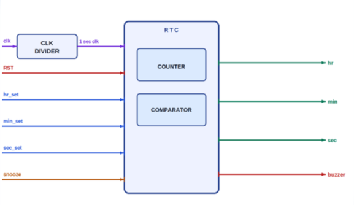

### Major Blocks

- Clock Divider
- RTC Counter
- Comparator
- Alarm/Buzzer Logic

---

# ASIC Design Flow

## 1. RTL Design

The RTC was designed using **Verilog HDL**, implementing:

- Clock Divider
- Second Counter
- Minute Counter
- Hour Counter
- Alarm Comparator
- Buzzer Logic

---

## 2. Functional Simulation

The RTL design was simulated to verify the correct counting of seconds, minutes, and hours along with alarm functionality.

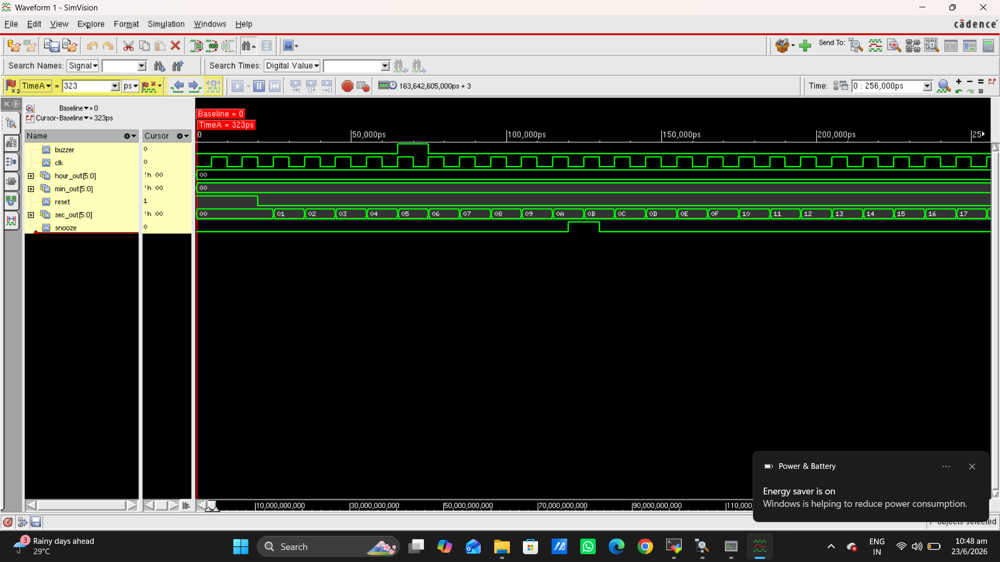

---

## 3. RTL Synthesis

The Verilog RTL was synthesized into a gate-level netlist using Cadence Genus.

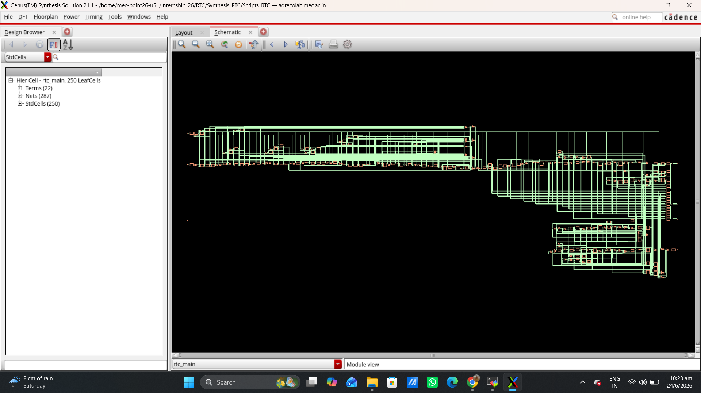

---

## 4. Area Report

Area utilization after synthesis was analyzed to determine silicon resource usage.

---

## 5. Timing Report

Static Timing Analysis (STA) was performed to verify timing closure and ensure the design met timing requirements.

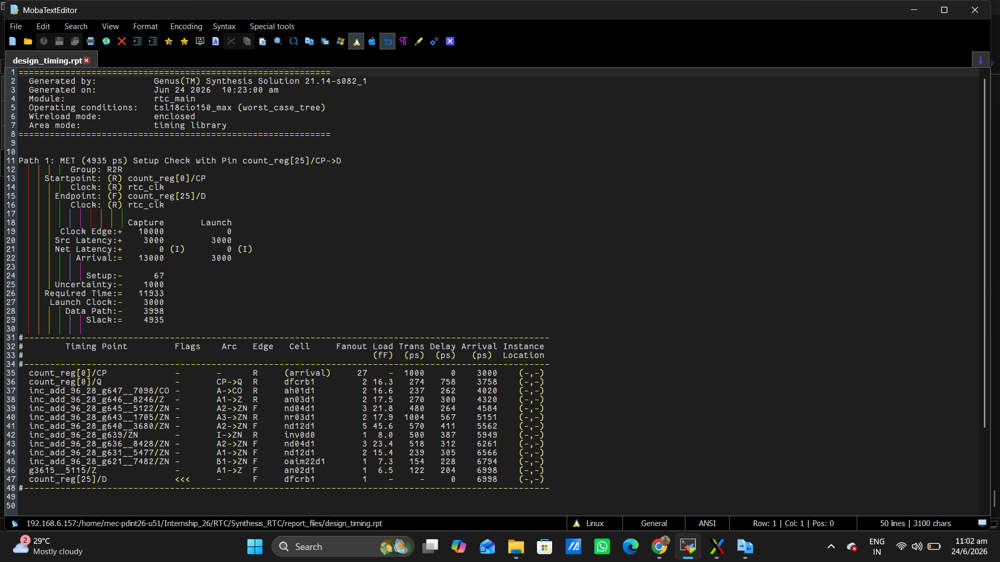

---

## 6. Power Report

Power estimation was carried out to evaluate dynamic and leakage power consumption.

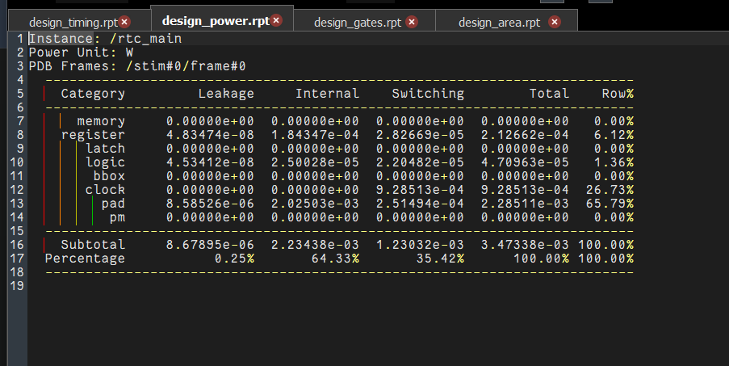

---

## 7. Gate Report

The synthesized netlist was analyzed to determine gate count and hardware utilization.

---

# Physical Design

## Floor Planning

The initial floorplan defines the core area, IO placement, and routing resources.

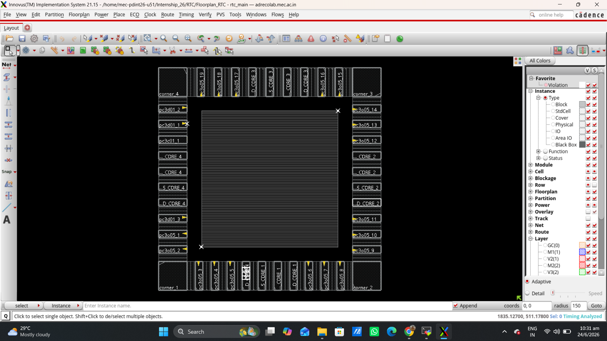

---

## Power Planning

Power rings and power stripes were inserted to ensure stable power distribution.

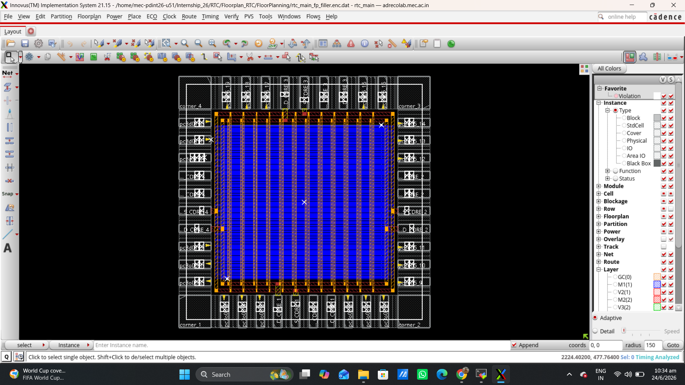

---

## Placement

Standard cells were placed within the core while optimizing congestion and timing.

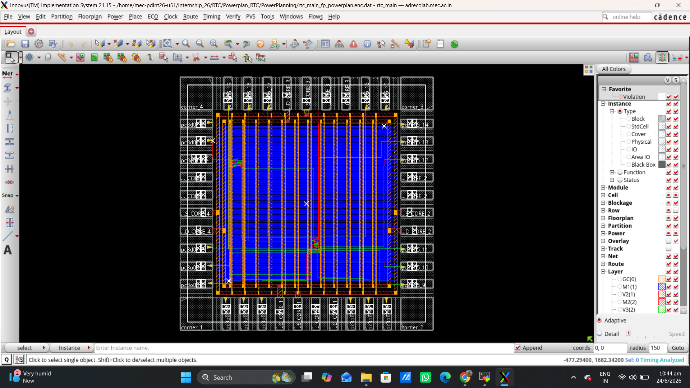

---

## Clock Tree Synthesis (CTS)

Clock buffers and routing were inserted to minimize clock skew and balance clock distribution.

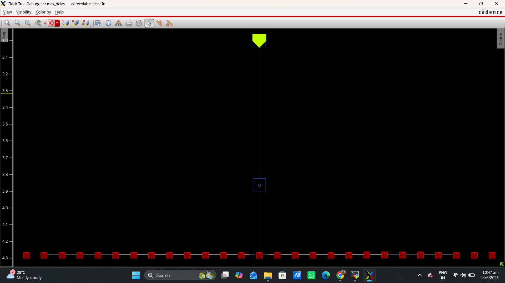

---

## Routing

Signal routing was completed while satisfying design rules and timing constraints.

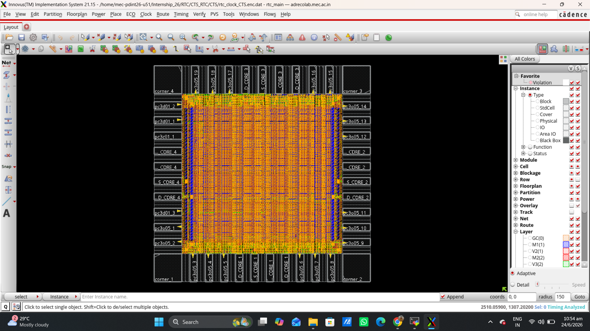

---

## Signoff

The final layout was generated after completing the ASIC implementation flow.

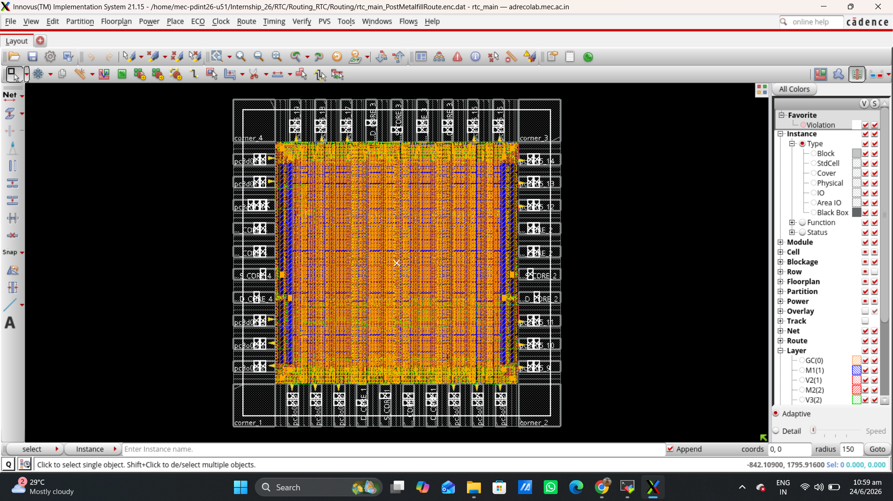

---

# Tools Used

- Cadence Genus
- Cadence Innovus
- Verilog HDL
- TCL Scripting

---

# Project Team

**Team 13**

- Francisca Thankachan
- Annada S
- Nikhil P Rajeesh

---

# Branch Information

## `main`

Complete ASIC implementation including:

- RTL Design
- Simulation
- Synthesis
- Reports
- Floorplanning
- Power Planning
- Placement
- Clock Tree Synthesis
- Routing
- Signoff

---

## `master`
Contains the **FPGA implementation** codes

- Verilog source code
- Testbench
- FPGA constraints

---

# Acknowledgements

We sincerely thank:

- **Government Model Engineering College, Kochi**
- **IEEE MEC Student Branch**
- **IEEE CASS Kerala Chapter**

for organizing the **Digital IC Design Internship** and providing hands-on experience with the complete Cadence ASIC Design Flow.
